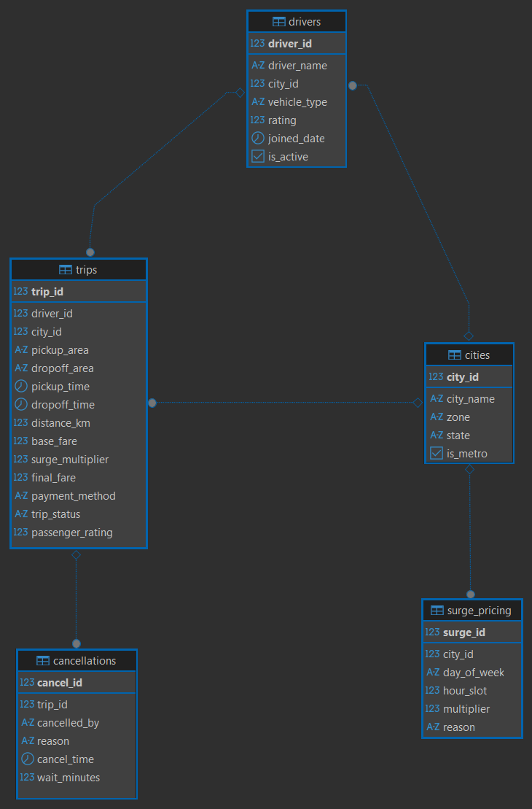
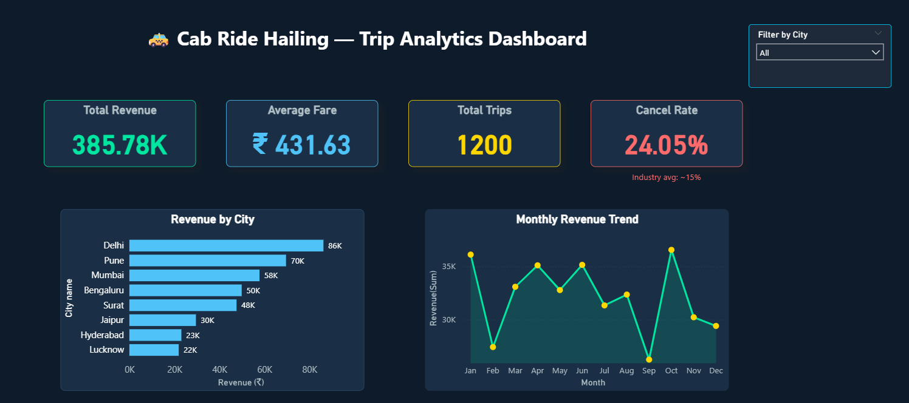

# 🚕 Cab Ride Hailing — Trip Analysis & Operational Insights

## Project Overview
End-to-end SQL analytics project analyzing **1,200 cab trip records**
across **8 Indian cities** to uncover revenue trends, cancellations,
and demand-supply gaps.

**Business Problem:** A cab aggregator wants to understand high cancellation rates (~25%),
identify underserved zones, and evaluate the impact of surge pricing
on revenue.

## ER Diagram

## Dashboard Preview

## Tools Used
| Tool | Purpose |
|------|---------|
| PostgreSQL + DBeaver | Database design & all SQL queries |
| Python 3 | Synthetic dataset generation (1,200+ rows) |
| Power BI / Excel | Dashboard & visualization |
| Git + GitHub | Version control & portfolio hosting |

## Dataset Overview
| Table | Rows | Description |
|-------|------|-------------|
| trips | 1,200 | Core fact table — fare, distance, status |
| drivers | 50 | Driver profiles, ratings, vehicle type |
| cities | 8 | Metro + Tier-2 city details |
| cancellations | 250+ | Cancelled/no-show trip details |
| surge_pricing | 448 | Time-slot based surge multiplier log |

## Key Business Insights
- 🏆 Top 10% drivers generated **38% of total revenue** (NTILE window analysis)
- ⚡ Surge pricing = **22% of revenue from only 9% of trips**
- 📍 **3 high-demand zones** with 40%+ supply gap identified (Airport, IT Park)
- ❌ Platform lost **~18% potential revenue** to cancellations
- 🏙️ Metro cities yield **47% higher avg fare** vs Tier-2 cities
- ⏰ Peak revenue hours: **8 AM and 6–8 PM** (combined 41% of daily revenue)

## SQL Techniques Used
- Window Functions: `RANK()`, `DENSE_RANK()`, `NTILE()`, `LAG()`, `ROW_NUMBER()`
- CTEs: Multi-step analysis with `WITH` clause
- Subqueries: Filtered aggregations and correlated queries
- Aggregations: `GROUP BY`, `HAVING`, `CASE WHEN`
- Joins: Multi-table `JOIN` across 5 normalized tables
- Date functions: `DATE_TRUNC()`, `EXTRACT()`, `TO_CHAR()`
- Data modeling: Normalized schema design (3NF)

## How to Run This Project
1. Clone: `git clone https://github.com/Sakshiii-xxv/cab-trip-analysis.git`
2. Generate data: `python data/generate_data.py`
3. Open DBeaver → connect PostgreSQL → create `cab_analysis` DB
4. Run `sql/01_schema.sql` to create tables
5. Import CSVs via DBeaver Import Wizard (cities → drivers → trips → surge → cancellations)
6. Run queries in order: `02` → `03` → `04`

## Project Structure
\`\`\`
cab-trip-analysis/
├── data/
│   ├── raw/                     ← 5 generated CSV files
│   └── processed/               ← exported query results
├── sql/
│   ├── 01_schema.sql            ← table creation + indexes
│   ├── 02_basic_analysis.sql    ← GROUP BY, HAVING queries
│   ├── 03_advanced_analysis.sql ← window functions, CTEs
│   └── 04_insights.sql          ← business insight queries
├── docs/
│   ├── er_diagram.png
│   ├── dashboard_preview.png
│   └── insights_summary.md
├── dashboard/
│   └── cab_trip_dashboard.xlsx / .pbix
└── README.md
\`\`\`

## Author
**Sakshi**
